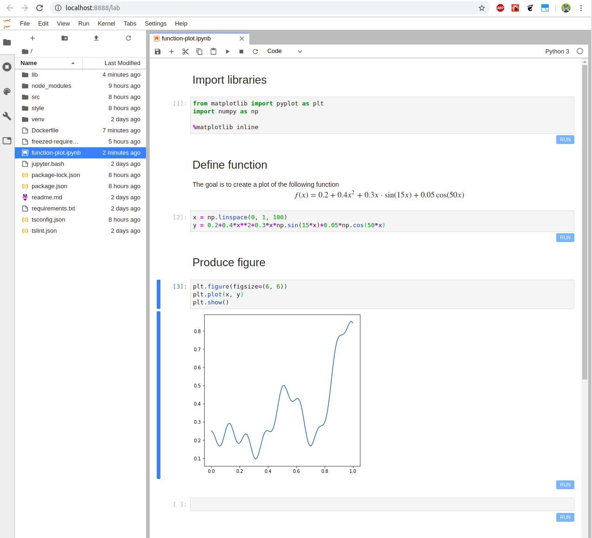

# jupyterlab-codecellbtn

A JupyterLab extension for notebook cells, which appends a 'run' button to the footer of each code cell.



## Prerequisites
Install `JupyterLab`.

If you like to install `jupyterlab` whithin the virtual environment, you can use the following script. To use this script in `Ubuntu/Debian` you might need to additionally install the following package
```shell
sudo apt install python3-venv
```
This script creates a fresh `python3` virtual environment in the folder `venv`.
```shell
bash jupyter.bash
```

## Installation
```shell
jupyter labextension install @ibqn/jupyterlab-codecellbtn
```

## Development
For a development install do the following in the repository directory:
```shell
yarn install
yarn build

source './venv/bin/activate'
jupyter labextension link .
jupyter lab --watch
```
To rebuild the package and the JupyterLab app:
```shell
yarn build
jupyter lab build
```

Build docker container
```shell
docker build --tag=jupyterlab_ext .
```
and launch it
```shell
docker run -p 9999:80 jupyterlab_ext
```